# RestockIQ — Restaurant Inventory Management System

A cloud-based inventory management system built to solve a real problem I observed working in a restaurant.

---

## The Problem

During my time working in a restaurant, I noticed managers spent time every day tracking stock with just a pen and paper. It was clearly tedious work — and even then it wasn't reliable. The restaurant would still run out of items and only realise once they were completely gone, meaning we'd be out of that product for a couple of days while waiting for the next order.

The root issues were:
- Stock tracking was manual, slow, and done after the fact
- There was no way to see stock levels in real time
- Orders were only placed once something had already run out

---

## The Solution

RestockIQ is a web application that live tracks restaurant stock levels, predicts when items are going to run out based on usage patterns, and alerts managers before it becomes a problem.

---

## Features

- Live inventory dashboard showing current stock levels colour coded by status
- Staff can quickly log how much of an item has been used
- Predictions use a 3 day forward average to avoid unnecessary orders being triggered by a single day's usage pattern
- Automated low stock alerts so managers can order before running out
- Automated nightly stock check via AWS Lambda and EventBridge — runs at midnight, checks all stock levels against thresholds, and sends SNS email alerts for any items running low without requiring manual triggers

---

## Tech Stack

| Layer | Technology |
|---|---|
| Backend | Python Flask |
| Frontend | HTML + Tailwind CSS |
| Database | AWS RDS (PostgreSQL) |
| Containerisation | Docker + AWS ECR |
| Hosting | AWS ECS Fargate |
| Infrastructure | Terraform |
| CI/CD | GitHub Actions |
| CDN & HTTPS | AWS CloudFront |
| DNS | AWS Route 53 |
| Alerting | AWS SNS |
| Automation | AWS Lambda + EventBridge |
| Monitoring | AWS CloudWatch |
| Secrets | AWS SSM Parameter Store |
| State Management | S3 + DynamoDB |
| SSL | AWS Certificate Manager |

---

## Architecture

When a user visits `restockiq.net` in their browser, Route 53 acts as the DNS resolver — translating the domain name into an IP address so the request can be routed correctly.

The request first hits CloudFront, AWS's global content delivery network, which routes it to the nearest edge location for faster response times. CloudFront forwards the request to the origin — an Application Load Balancer (ALB) sitting in a public subnet in eu-west-2 (London).

The ALB routes traffic to the application running on AWS ECS Fargate — a serverless container platform. The Docker image for the application is stored in Amazon ECR and pulled by ECS at deployment time. The Flask application running inside the container connects to an Amazon RDS PostgreSQL database in a private subnet — isolated from the internet and only accessible from within the VPC.

The response travels back through the same path — ECS to ALB to CloudFront to the user's browser.

Outside of the core request flow, a scheduled AWS Lambda function runs every night at midnight triggered by an EventBridge rule. It connects directly to RDS, checks all stock levels against their thresholds, and publishes an alert to an SNS topic if any items are running low — sending an email notification to the manager automatically.

CloudWatch monitors the health of the entire system with alarms on ECS CPU and memory utilisation, ALB error rates, unhealthy host counts, and Lambda function errors. All alarms publish to a dedicated SNS topic so the right people are notified immediately if anything goes wrong.

All infrastructure is provisioned and managed as code using Terraform, with state stored remotely in an S3 bucket and state locking handled by DynamoDB.

---

## Security

Security was considered at every layer of the architecture rather than as an afterthought.

**Secrets Management**
All sensitive values including database passwords and the Flask secret key are stored in AWS SSM Parameter Store as SecureString parameters, encrypted at rest using AWS KMS. Secrets are never hardcoded in application code, Terraform files, or environment variables. This approach also enables centralised secret rotation without requiring any code changes or redeployment.

**Network Security**
The RDS PostgreSQL database sits in a private subnet with no internet gateway route, making it completely inaccessible from the public internet. A dedicated security group restricts inbound database connections to port 5432 exclusively from the ECS task security group — no other service or IP address can reach the database directly.

**Container Security**
The Docker container runs as a non-root user, limiting the blast radius of any potential container breach. The ECS task security group only allows inbound traffic from the ALB security group on the application port — direct internet access to containers is blocked entirely.

**Traffic Security**
All traffic is served over HTTPS via CloudFront with TLS 1.2 as the minimum protocol version. HTTP requests are automatically redirected to HTTPS. CloudFront also provides AWS Shield Standard DDoS protection automatically at no extra cost.

**IAM Least Privilege**
Two separate IAM roles are used for ECS — an execution role for pulling images and writing logs, and a task role for what the running application can access. Each role has only the minimum permissions required. The Lambda function has its own dedicated IAM role scoped specifically to CloudWatch logging, SNS publishing, and the EC2 network interface permissions required to run inside the VPC.

**Infrastructure Security**
Terraform state is stored in an S3 bucket with versioning, encryption at rest, and all public access blocked. DynamoDB state locking prevents concurrent Terraform runs from corrupting infrastructure state.

---

## Deployment

### Prerequisites
Ensure the following are installed locally before proceeding:
- AWS CLI
- Terraform >= 1.10
- Docker
- Python 3.12
- Git

### 1. Clone the Repository
```bash
git clone https://github.com/YOUR_USERNAME/restaurant-inventory.git
cd restaurant-inventory
```

### 2. AWS Setup
Create an IAM user in the AWS Console with AdministratorAccess and generate access keys. Configure the AWS CLI with those credentials:
```bash
aws configure --profile restockiq
export AWS_PROFILE=restockiq
```

### 3. Create Terraform Backend
```bash
aws s3api create-bucket \
  --bucket restockiq-terraform-state \
  --region eu-west-2 \
  --create-bucket-configuration LocationConstraint=eu-west-2

aws s3api put-bucket-versioning \
  --bucket restockiq-terraform-state \
  --versioning-configuration Status=Enabled

aws dynamodb create-table \
  --table-name restockiq-terraform-locks \
  --attribute-definitions AttributeName=LockID,AttributeType=S \
  --key-schema AttributeName=LockID,KeyType=HASH \
  --billing-mode PAY_PER_REQUEST \
  --region eu-west-2
```

### 4. Store Secrets in SSM
```bash
aws ssm put-parameter --name "/restockiq/production/db_password" \
  --value "YOUR_DB_PASSWORD" --type "SecureString" --region eu-west-2

aws ssm put-parameter --name "/restockiq/production/secret_key" \
  --value "YOUR_SECRET_KEY" --type "SecureString" --region eu-west-2
```

### 5. DNS and SSL Setup
- Register your domain and create a Route 53 hosted zone
- Update your domain registrar nameservers to the Route 53 nameservers
- Request an ACM certificate in **us-east-1** for your domain
- Validate via Route 53 DNS validation and wait for status to show Issued

### 6. GitHub Actions Setup
Add the following secrets to your GitHub repository under Settings → Secrets and variables → Actions:
- `AWS_ACCESS_KEY_ID`
- `AWS_SECRET_ACCESS_KEY`

### 7. Deploy Infrastructure
```bash
cd terraform
terraform init
terraform plan
terraform apply
```

### 8. Push Docker Image to ECR
On first deployment push the image manually before the pipeline runs:
```bash
aws ecr get-login-password --region eu-west-2 | docker login --username AWS --password-stdin YOUR_ACCOUNT_ID.dkr.ecr.eu-west-2.amazonaws.com
docker build -t restockiq .
docker tag restockiq:latest YOUR_ACCOUNT_ID.dkr.ecr.eu-west-2.amazonaws.com/restockiq:latest
docker push YOUR_ACCOUNT_ID.dkr.ecr.eu-west-2.amazonaws.com/restockiq:latest
```

### 9. Deploy Application
```bash
git push origin main
```

The pipeline will automatically build the Docker image, push to ECR, and deploy to ECS. The application will be available at your domain once ECS reports the service as stable.

---

## Running Locally

### Prerequisites
- Python 3.12
- Docker

### Setup
```bash
# Clone the repo
git clone https://github.com/YOUR_USERNAME/restaurant-inventory.git
cd restaurant-inventory

# Create virtual environment
python3 -m venv venv
source venv/bin/activate

# Install dependencies
pip install -r requirements.txt

# Create environment file
echo "DATABASE_URL=sqlite:///inventory.db
SECRET_KEY=local-dev-secret-key" > .env

# Run the app
python run.py
```

Visit `http://localhost:5001` in your browser. The app uses SQLite locally so no database setup is required.

---

## CI/CD Pipeline

The GitHub Actions pipeline triggers automatically on every push to the main branch and consists of two sequential jobs.

The first job installs Python and all dependencies then runs the test suite against the committed code. If any tests fail the pipeline stops immediately and the second job does not run, preventing broken code from ever reaching production.

If tests pass the second job begins. It configures AWS credentials, logs into Amazon ECR, then builds a new Docker image tagged with the Git commit SHA for traceability. Both a versioned tag and a `latest` tag are pushed to ECR ensuring every deployment can be traced back to the exact commit that produced it and rolled back if needed.

The pipeline then downloads the current ECS task definition, updates it with the new image, and triggers a deployment to the ECS cluster. It waits for the service to reach a stable state before marking the pipeline as complete — if the new container fails to start the pipeline fails and alerts the team, ensuring broken deployments are caught immediately rather than silently.

---

## Screenshots

### Application
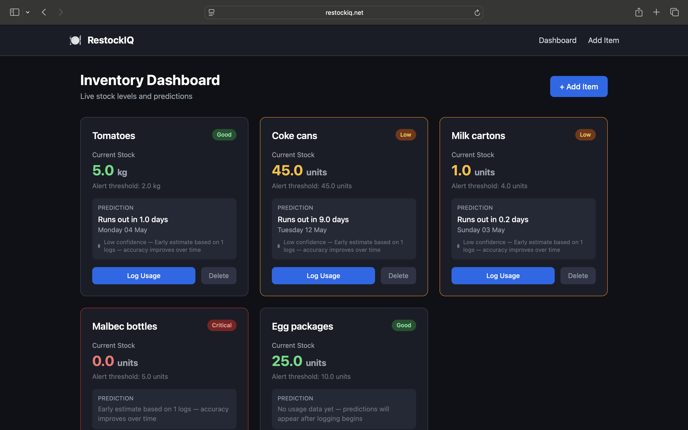
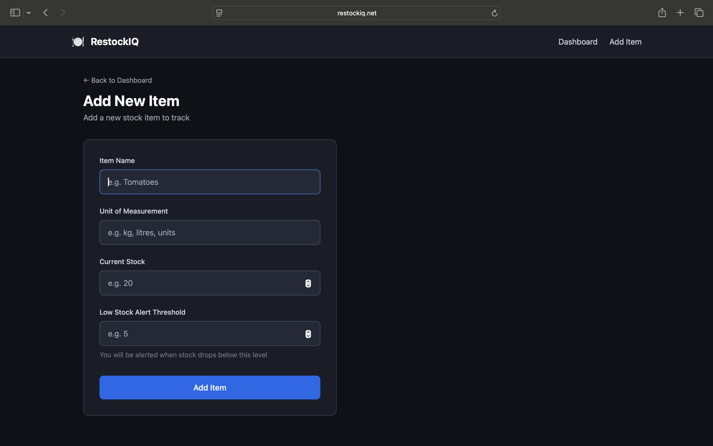
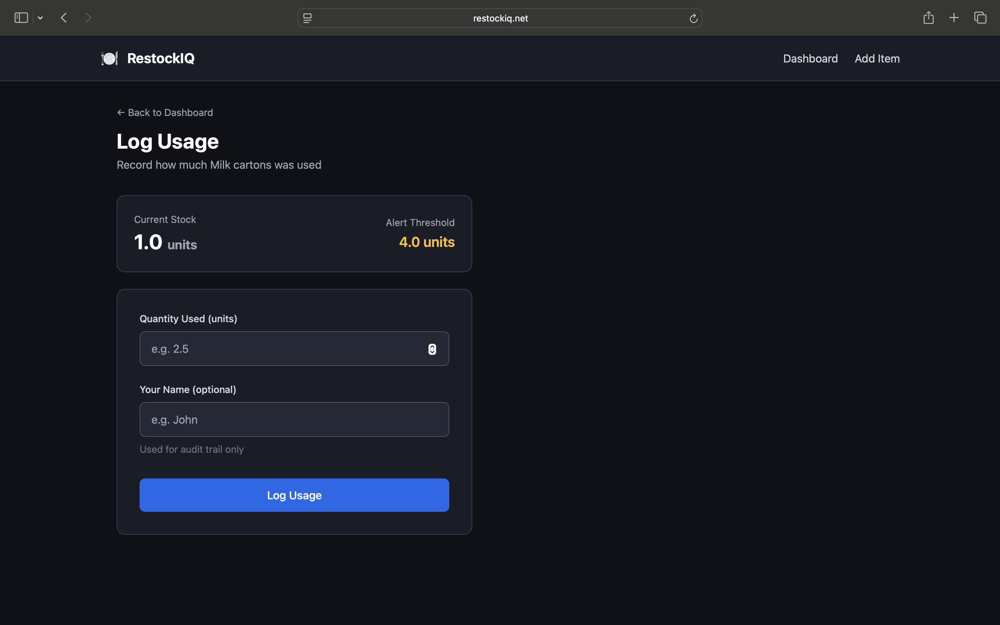
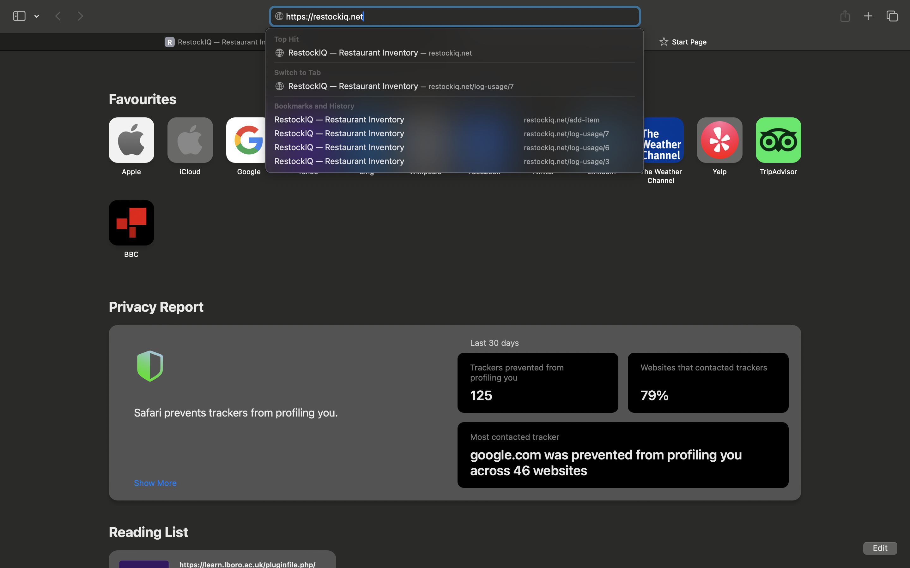

### AWS Infrastructure
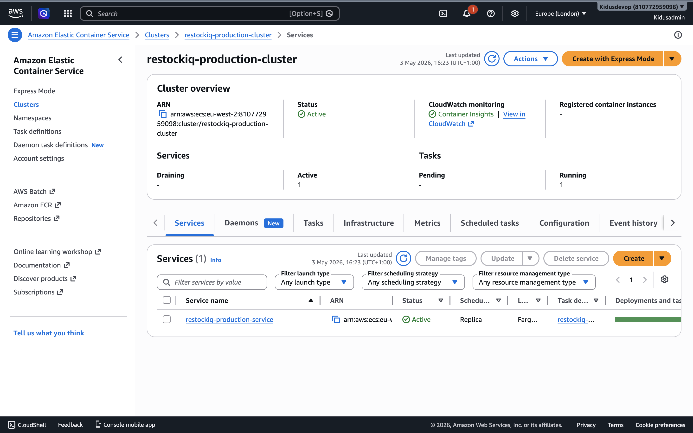
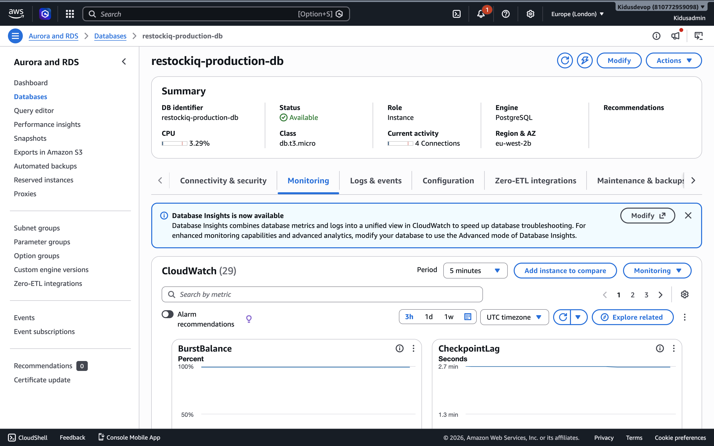
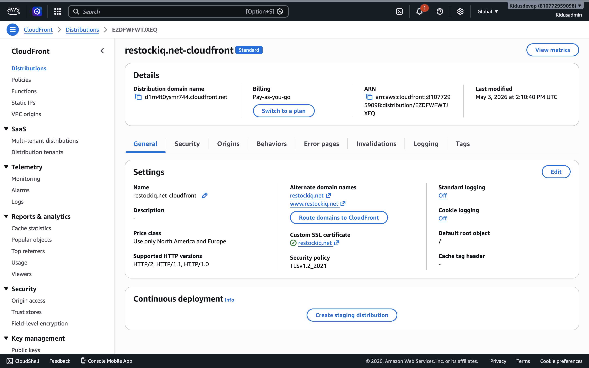
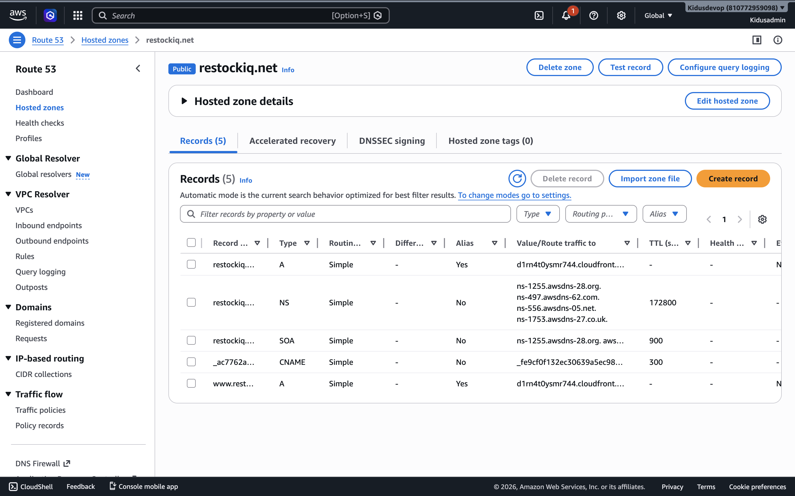
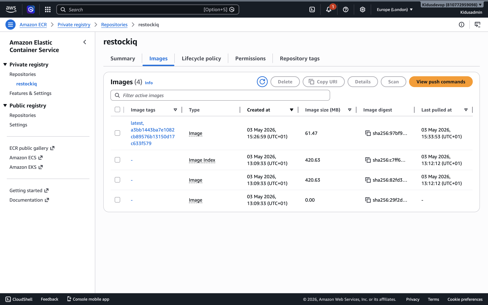
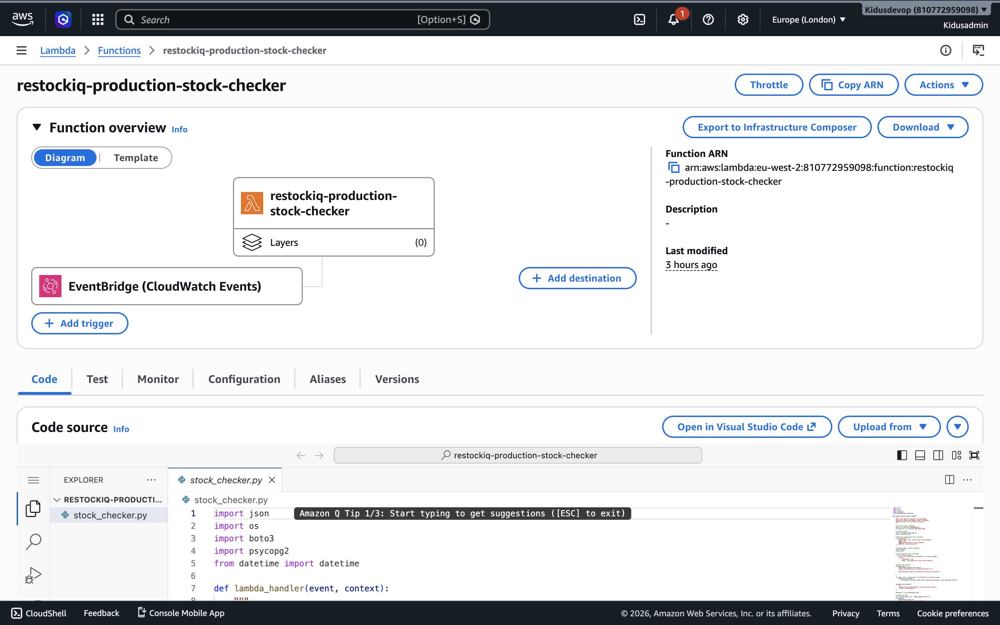


### Monitoring & Alerts


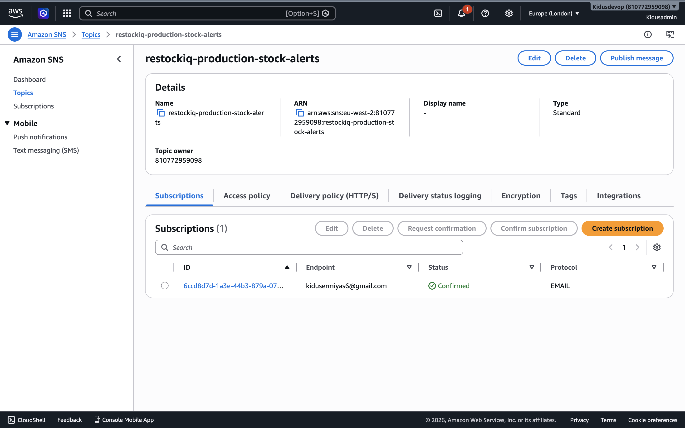
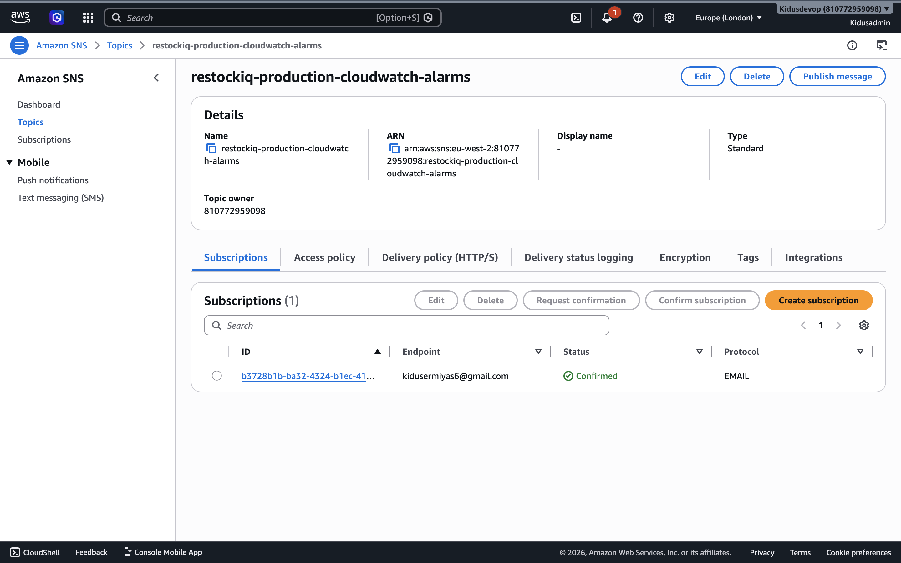

### CI/CD Pipeline
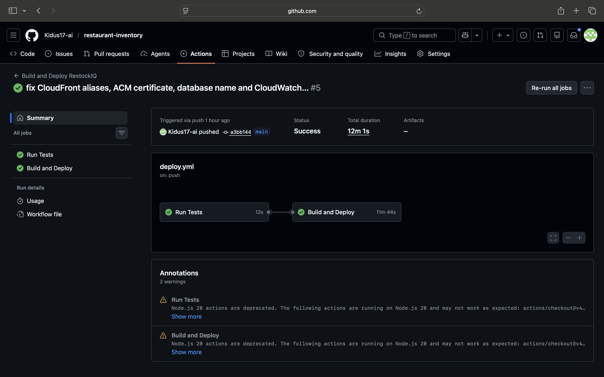


---

## Challenges & Learnings

**Cascading Delete Bug**
When trying to delete an item from the dashboard the app threw an internal server error. After investigating the database I found that each item had stock logs attached to it in a separate table. Because item is a foreign key on the stock logs table with a NOT NULL constraint, the database refused to delete the parent record while child records still referenced it. The fix was to delete all related stock logs first before deleting the parent item — teaching me the importance of understanding database relationships and constraints before designing delete operations.

**Prediction Threshold Sensitivity**
My initial prediction logic only used the current day's average usage to determine whether stock was running low. I realised this could trigger unnecessary orders — for example on a Saturday night stock might look critically low based on Saturday's high usage average, triggering an automatic order, when in reality Sunday's much lower usage meant stock was perfectly fine. I fixed this by switching to a 3 day forward average which looks at today plus the next two days combined, giving a much more stable and accurate picture of actual demand.

**ECS vs EKS**
When deciding how to host the application I considered both ECS and EKS. Kubernetes through EKS would have added significant complexity — managing node groups, cluster upgrades, kubectl configuration and Helm charts — for no real benefit at this scale. RestockIQ is a single containerised application with straightforward scaling needs. ECS with Fargate was the right tool — serverless containers with no server management, simpler configuration, and lower operational overhead. Choosing the right tool for the scale of the problem rather than over-engineering it was an important lesson.

**Lambda VPC Networking**
While writing the Lambda Terraform configuration I researched VPC networking requirements and discovered that Lambda functions running inside a VPC require specific EC2 permissions to create an elastic network interface — needed to communicate with other VPC resources like RDS. Without `ec2:CreateNetworkInterface`, `ec2:DescribeNetworkInterfaces` and `ec2:DeleteNetworkInterface` the function would fail to start entirely. Adding these permissions preemptively avoided what would have been a confusing deployment failure since the error message doesn't immediately point to network interface permissions.

**ECR Empty Repository**
After running `terraform apply` the ECS service failed to start. Checking the CloudWatch logs showed ECS was unable to pull the container image as the ECR repository existed but contained no images. The pipeline had not yet successfully run so nothing had been pushed to ECR. The fix was to manually build and push the Docker image to ECR directly before forcing ECS to restart. This highlighted a classic chicken and egg problem in first time deployments — ECS needs an image in ECR to start, but the pipeline needs the infrastructure to exist before it can push. The solution is to always manually push an initial image after first running `terraform apply`, after which the pipeline handles all future deployments automatically.

**CloudFront 403 — Missing Domain Alias**
When trying to access the application via `restockiq.net` the browser returned a 403 error from CloudFront. After investigation I found the app was working correctly when accessed directly via the CloudFront URL and the ALB endpoint, which pointed to a routing issue rather than an application problem. The root cause was that `restockiq.net` had not been registered as an allowed domain on the CloudFront distribution. CloudFront was receiving requests for the domain but had no record of it being a valid domain it should serve, so it rejected them. The fix was adding an aliases block to the CloudFront Terraform resource registering both `restockiq.net` and `www.restockiq.net` as allowed domains.

**Database Name Mismatch**
After a successful `terraform apply` with no errors the application crashed on startup. Checking the CloudWatch logs revealed the error `FATAL: database "restockiq" does not exist` — the database had been created but the app couldn't connect to it. After investigating the Terraform code I found a mismatch between the database name in the root `main.tf` and what was actually created by the RDS module. The RDS module was deriving the database name from the `name_prefix` variable which included the environment name, creating a database called `restockiq_production`. However the app was trying to connect to `restockiq`. The fix was updating the database URL in `main.tf` to use the correct database name. This highlighted the importance of tracing application errors back through CloudWatch logs to identify infrastructure misconfigurations that don't surface during `terraform apply`.

---

## Future Improvements

**Seasonal Demand Forecasting**
The current prediction engine uses day-of-week averages which captures weekly patterns well. A natural extension would be incorporating monthly and yearly seasonal patterns — for example accounting for increased demand during summer or holiday periods. This would require a minimum of 12 months of usage data to be statistically meaningful and would significantly improve prediction accuracy for restaurants with strong seasonal trade.

**Stock Usage Visualisation**
All usage data is already being logged to the database, making it well suited for visualisation. A future improvement would be adding a reporting dashboard with graphs showing historical stock usage over time per item alongside the predicted future demand curve. This would give managers a clearer picture of trends and help inform smarter ordering decisions.

**Automatic Supplier Ordering**
The existing Lambda stock checker currently sends an email alert when items run low. A natural extension would be integrating with supplier APIs to automatically place orders when stock hits the threshold, removing the need for any manual intervention. This would require supplier API agreements and a human approval workflow before orders are confirmed to prevent accidental orders in the event of a prediction error.

**ECS Auto Scaling**
The current deployment runs a fixed number of ECS tasks regardless of traffic. Implementing ECS Service Auto Scaling using CloudWatch metrics such as CPU utilisation and request count would allow the application to automatically scale up during busy periods and scale back down during quiet times, improving both resilience and cost efficiency.

**POS Partial Integration**
Rather than full automatic stock deduction from sales — which would be less accurate than manual logging as it doesn't account for wastage, spillage, and preparation usage — a useful integration would be a side by side view comparing what was sold versus what was manually logged. This would help managers identify discrepancies and wastage patterns over time.

---

## Author
Kidus Ermiyas Tesfaye**

